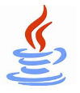

<h1 align="center">God dag 👋,  I'm feiria </h1>

✨ 不想当公务员的学生不是好码农
 

<h3>Languages and Frameworks</h3>

<code></code>
<code></code>
<code></code>
<code></code>
<code></code>
<code></code>
<code></code>

<h3>Tools and Environments</h3>

<code></code>
<code></code>
<code></code>
<code></code>
<code></code>
<code></code>
<code></code>
<code></code>

## 💬 Talk with me
- Backend web development (Java, Go)
- 2D Object Detection (Pytorch)
- Multi-Modal Classification (Pytorch)
- Machine Learning (Scikit-learn, LightGBM)

## 📅 Hobbies
- Read comics 📚
- Watch ACG 📺
- Participate in relevant competitions ⌨
- Play basketball🏀
- etc.

## ⌨ Competition Awards
- 2020 微信小程序应用开发赛 全国三等奖 (队员)
- 2021 江西开放数据创新应用大赛 优秀奖 (队长)
- 2022 中国高校计算机大赛-大数据挑战赛 全国三等奖 (队长)
- 2023 IJCAI Workshop Challenge Track 1: Horizontal Detection (23th in set1) (队长)

[PyTorch]:https://img.shields.io/badge/PyTorch-black?style=flat-square&logo=pytorch
[Pandas]:https://img.shields.io/badge/Pandas-black?style=flat-square&logo=pandas
[Scikit-learn]:https://img.shields.io/badge/Scikit-learn-black?style=flat-square&logo=scikit-learn
[SciPy]:https://img.shields.io/badge/SciPy-black?style=flat-square&logo=scipy
[NumPy]:https://img.shields.io/badge/NumPy-black?style=flat-square&logo=numpy
[Python]:https://img.shields.io/badge/Python-black?style=flat-square&logo=python
[Go]:https://img.shields.io/badge/Go-black?style=flat-square&logo=go
[Shell]:https://img.shields.io/badge/Shell-black?style=flat-square&logo=shell
[Mysql]:https://img.shields.io/badge/Mysql-black?style=flat-square&logo=Mysql
[Markdown]:https://img.shields.io/badge/Markdown-black?style=flat-square&logo=markdown
[JupyterNotebook]:https://img.shields.io/badge/Jupyter-black?style=flat-square&logo=jupyter
[Docker]:https://img.shields.io/badge/Docker-black?style=flat-square&logo=docker

## 🖥️ My Open-Source Projects
|                             Title                              |                       Description                        |                                                          Stars                                                          |                                          Technologies                                           |                                          Progressing                                          |
|:--------------------------------------------------------------:|:--------------------------------------------------------:|:-----------------------------------------------------------------------------------------------------------------------:|:-----------------------------------------------------------------------------------------------:|:---------------------------------------------------------------------------------------------:|
|      [go-template](https://github.com/feiria/go-tempalte)      |          golang web项目的快速开发模板，仅供学习参考           |       |                  ![Go][Go] ![Mysql][Mysql] ![Shell][Shell]  ![Docker][Docker]                   |   |
|     [GoLangTricks](https://github.com/feiria/GoLangTricks)     |                 golang中的实用小技巧                 |      |                          ![Go][Go] ![Shell][Shell]  ![Docker][Docker]                           |   |
| [machine-learning](https://github.com/feiria/machine-learning) |         scikit-learn简单使用示例, 便于初学者快速上手         |  | ![Python][Python] ![Scikit-learn][PyTorch]  ![JupyterNotebook][JupyterNotebook] ![Numpy][Numpy] |  |
|             [tide](https://github.com/feiria/tide)             |           TIDE的个人魔改版，添加了矢量图导出等自定义功能           |              |                     ![Python][Python] ![PyTorch][PyTorch]  ![Numpy][Numpy]                      |  |
|          [arsenal](https://github.com/feiria/arsenal)          | 比赛武器库，包含EMA、FDM等深度学习通用Tricks和用于处理CSV数据的特征工程代码 |           |         ![Python][Python] ![PyTorch][PyTorch] ![Scikit-learn][PyTorch] ![Numpy][Numpy]          |    |

 

  

